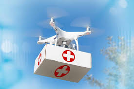

# Drone Dispatch System (DDS) - Medical Supplies Delivery

 
*Swift, Safe, Smart Deliveries using Autonomous Drones*

---

## Project Overview
The Drone Dispatch System (DDS) is a cutting-edge, web-based platform engineered to redefine emergency medical logistics through autonomous drone technology. Designed to ensure life-saving medical supplies reach the most inaccessible and disaster-struck regions within minutes, DDS leverages intelligent algorithms, real-time tracking, and advanced route optimization for unmatched speed, safety, and reliability.

Built by Team Drone Developers (T080) from Thapar Institute of Engineering & Technology, Patiala, this system represents a powerful leap toward the future of healthcare delivery, where every second counts and technology saves lives.

---

## Problem Statement

Despite major progress in drone technology, its life-saving potential for emergency medical delivery remains largely untapped. Traditional logistics fail in disaster zones and remote areas, causing deadly delays. Existing drone solutions are costly, geographically limited, and lack autonomy, leaving a critical gap for a scalable, intelligent, and rapid-response system.

---

## Solution Description

The **Drone Dispatch System (DDS)** platform empowers verified users with **cutting-edge features for life-saving operations**:

✅ **Select Essential Medical Payloads**  
Choose from a range of critical medical supplies — vaccines, blood units, emergency kits, anti-venom, and more — ensuring timely aid during crises.  

✅ **Pinpoint Exact Delivery Coordinates**  
Input precise latitude and longitude to deliver supplies to the most **remote, rural, or disaster-struck areas** without error.  

✅ **Track Drones in Real-Time**  
Monitor live drone movements on an **interactive Leaflet.js-powered map**, providing **full mission transparency and control**.  

✅ **Harness AI-Optimized Navigation**  
Experience **machine learning-driven route optimization**, where drones dynamically adapt for the **fastest, safest, and most efficient paths** — overcoming obstacles, weather disruptions, and terrain challenges.  

✅ **Secure & Verified Access**  
Only authorized users can schedule dispatches, ensuring **security, integrity, and accountability** in emergency deliveries.  

---

## **Navigation Model**

Swift, Safe, Smart Deliveries using Autonomous Drones

### **How It Works**
- **Graph-based pathfinding** using ML algorithms for optimized routing.
- **Dynamic adjustments** based on:
  - Obstacles
  - Weather conditions
  - Airspace restrictions
- **Integration with Leaflet.js** for real-time visualization.
- **GPS Precision** + **Aiven Cloud Database** for continuous data sync.

*This ensures shortest, safest, and most efficient routes for medical supply delivery.*

---

## Technology Stack
| Component      | Technology |
|---------------|-----------|
| **Backend**   | Flask (Python) |
| **Frontend**  | HTML, CSS, JavaScript, Leaflet.js |
| **Database**  | Aiven Cloud |
| **Route Optimization** | Machine Learning |

---

## Screenshots
### **Dashboard**
### **Admin Dashboard**
The **Admin Dashboard** gives full control to administrators:  
 -Manage **users, admins, and vaccine inventory**  
 -Monitor **drone status, availability, and battery health**  
 -Track **active, completed, and failed deliveries** in real time  

### **Tracking Page**
The **Tracking Page** lets users:  
-**Select vaccines and enter delivery coordinates**  
 -**Verify location within operational range** using distance calculation  
 -**Track real-time drone status** and mission progress with live updates  

---

## Future Roadmap
- ✅ Partnerships with hospitals
- ✅ Computer vision for safe landing
- ✅ Swarm drone coordination

---

## Team Members
| Name | Role | Contact |
|------|------|---------|
| Lakshita | AI/ML Implementation | lakshitaaggarwal2411@gmail.com |
| Lahari | Frontend | bomminenilahari@gmail.com |
| Kamesh | Backend | yadavkamesh91@gmail.com |
| Kaamya | UI/UX | kmathpal_be24@thapar.edu |
| Aryan | Backend | aryanawasthi017@gmail.com |
| Abhinab | Drone Logic & Visualization | abhinab2k05@gmail.com |

---

## Contact
📧 achheri_be23@thapar.edu  
🌐 *Contributions Welcome!*

---
